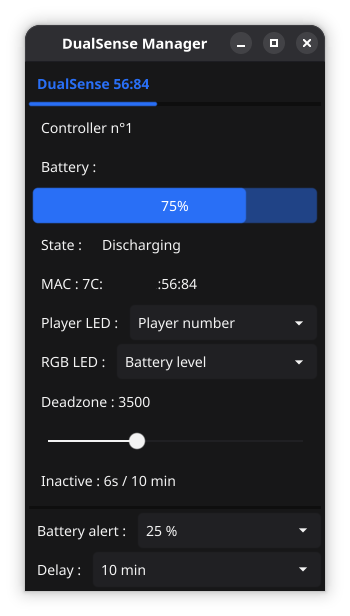

DualSense Manager
=================

[](https://github.com/Lutty76/dualsense-manager/actions)

A small desktop utility to monitor and manage DualSense controllers on Linux. It displays battery level, charging state, controller MAC, controls LEDs/RGB behaviors and auto turn off when idle. Built with Go and the Fyne GUI toolkit.

### Features
- Monitor battery level & charging state
- Automatic LED/RGB behavior and charging animations
- Auto-disconnect after inactivity
- System tray support
- Verbose logging option

### Prerequisites
- libudev and access to `/sys/class/leds` (udev rules below)
- A Linux desktop environment (system tray support required for tray features)

### Building
```bash
# From project root
go build -o dualsense-mgr
# Or run directly
go run .
```

### Running
- Start normally: `./dualsense-mgr`
- Start hidden in system tray: `./dualsense-mgr -hide` or `-h`
- Debug logging: `./dualsense-mgr -debug` or `-d`
- Show version: `./dualsense-mgr -version` or `-v`

#### Precompiled binary
A precompiled binary will be provided in the repository release for convenience. You can download that binary and run it directly (ensure it is executable with `chmod +x`).

udev rules (required)
Create a udev rules file to set permissions for DualSense LED controls. Example file:

```bash
sudo nano /etc/udev/rules.d/999-dualsense-final.rules
```

Paste the following:
```
# Rule for Player LEDs (white)
SUBSYSTEM=="leds", KERNEL=="*player*", MODE="0666", RUN+="/bin/chmod 666 %S%p/brightness %S%p/trigger"

# Rule for Indicator (RGB) - add multi_intensity
SUBSYSTEM=="leds", KERNEL=="*indicator*", MODE="0666", RUN+="/bin/chmod 666 %S%p/brightness %S%p/trigger %S%p/multi_intensity"
```
Then reload rules and trigger:

```bash
sudo udevadm control --reload-rules
sudo udevadm trigger
```
This ensures the application (or user processes) can control the controller LEDs via the sysfs LED interfaces.

### Usage



Controller should detected automatically.

#### Controls
- **Player LED select**: choose how the white "player" LEDs behave. Options typically include showing the battery level or showing the controller number. 
- **RGB Led select**: select the indicator (RGB) LED mode. Options include `Battery` (color reflects battery level), `Static`, or `Off`.
- **DeadZone slider**: adjusts the joystick deadzone threshold to ignore small stick movements. Increase this value if you observe drift or unintended micro-movements that reset inactive timer.
- **Battery alert select**: pick the battery percentage threshold that triggers low-battery alerts/notifications (e.g. 15%).
- **Delay select**: sets the inactivity delay (auto-off) used by the app; when no input is detected for the chosen duration the controller may be disconnected automatically.


### Configuration
The app reads controller-specific settings from a YAML configuration file located by default at `$XDG_CONFIG_HOME/dualsense-manager/config.yaml` (or `~/.config/dualsense-manager/config.yaml`). Below is an example configuration generated by the application:

```yaml
idle_minutes: 10
battery_alert: 15
controllers:
		7C:AA:AA:AA:AA:AA:
				deadzone: 3000
				led_player: 1
				led_rgb_static: '#0F00FF'
		AC:AA:AA:AA:AA:AA:
				led_player: 1
				led_indicator: 1
				led_rgb_static: '#FF0000'
```

Fields
- `idle_minutes`: number of minutes of inactivity before the auto-disconnect timer triggers for a controller.
- `battery_alert`: battery percentage threshold used for alerts (e.g. notifications when below this level).
- `controllers`: map keyed by controller MAC address. Each entry customizes behavior for that controller:
	- `deadzone`: joystick deadzone value (integer) used to filter small stick movements.
	- `led_player`: mode for the player (white) LEDs — integer flag depending on UI choices (e.g. show battery, show player number).
	- `led_indicator`: enable/disable indicator (RGB) LEDs for this controller (boolean/integer).
	- `led_rgb_static`: hex color string for static RGB mode (e.g. `'#RRGGBB'`).

Notes
- If a controller-specific setting is missing, the app will use defaults from the global configuration.
- You can edit this file manually or let the application write defaults on first run.


### Contributing
Feel free to open issues or submit pull requests. Follow Go formatting conventions (`gofmt`) and keep changes minimal and focused.

### License
GPL-3.0 License
### FAQ

#### Will this be ported to Windows?
No, there are already excellent tools available for Windows, such as DS4Windows or built-in Steam support.
#### Will this be ported to macOS?
Currently, no. I don’t own a Mac, so I’m unable to develop or test on macOS. However, contributions are welcome if you'd like to help port it.
#### My controller turns off before the delay time — why?
Steam has built-in controller management that includes auto-disconnect features. If Steam is running, it may power off your controller before this app’s timer triggers. To fix this, disable auto-disconnect in Steam’s controller settings. Alternatively, if you always use Steam, you may not need this app — Steam already handles most of these functions.
